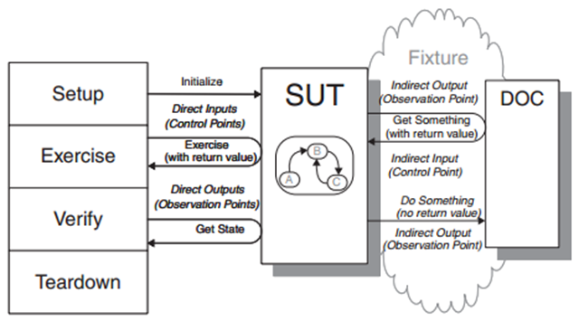

函数式编程（Functional Programming）的一大特点是不修改外部状态，仅仅产生返回值；也不依赖外部状态，函数仅依赖输入参数。换句话说不使用函数体作用域外的变量，函数有着很强的独立性。由此带来的好处包括：
1. 易于单元测试（Unit testing）
2. 方便调试（Debuging）
3. 高并发（Concurrency）
4. 热代码部署（Hot code deployment）

下图描述了单元测试的场景：  
  
图片来自于 xUnit Test Patterns – Refactoring Test Code一书

Setup，Exercise，Verify和Teardown是进行单元测试的典型过程。  
SUT（System Under Test）指被测的函数/方法。  
DOC（Dependent-On Component）是SUT依赖的组件，像关联的类，需要调用的函数/方法，上下文对象，全局对象以及运行环境等。

有过单元测试经验的人都知道，为了进行测试，往往需要编写大量的代码创造测试条件。原因就是因为DOC的存在。在函数式编程中，由于函数的独立性，DOC就不存在了。也就没有了对Indirect input（间接输入）的模拟，没有了对Indirect output（间接输出）的验证；仅使用Direct input（直接输入，就是参数），也仅验证Direct output（直接输出，就是返回值），因此单元测试就变得简单多了。

函数式编程是一种如何编写程序的方法论。并不是Lisp, Haskell，Erlang, F#这些函数式编程语言才能用的，在面向对象编程语言中也可以用这种思想。
```c#
public class Foo
{
    public string Bar()
    {
        // get user id from session
        string userID = HttpContext.Current.Session("UserID");
        // get image path from configuration file
        string imagePath = ConfigurationManager.AppSettings["ImagePath"];
        // do some thing with userID and imagePath
        // ......
    }
}
```
这段代码中HttpContext和ConfigurationManager就是DOC，是Bar方法的间接输入。如果进行单元测试的话，我们会对代码改造下，使用接口来代替具体类。
```c#
public class Foo
{
    public string Bar()
    {
        string userID = ISession.GetCurentUserID();
        string imagePath = IConfiguration.GetImagePath();
        // do some thing with userID and imagePath
        // ......
    }
}
```
使用了接口后，在进行单元测试的时候就可以通过Mock对象来模拟，避免了HttpContext和配置文件。  
接口的具体实现可以通过构造函数注入，属性注入或者方法注入。也可以通过IoC或者Service locator来获取。但无论哪种方式，都没有减少对外部的依赖。我们不妨按FP的思想，把依赖的外部状态变为参数。
```c#
public class Foo
{
    public string Bar(string userID, string imagePath)
    {
        // do some thing with userID and imagePath
        //  ......
    }
}
```
如果Foo类对应一个User的话，可以将userID参数提升到属性。
```c#
public class Foo
{
    public string UserID { get; set; }
    public string Bar (string imagePath)
    {
        // do some thing with UserID and imagePath
        // .....
    }
}
```
通过这种方式使Bar方法保持了独立性。按面向对象的说法是降低了耦合性。然而最终还是需要一个地方创建具体实例，把值传递进来。我们尽量把这些“脏活”集中起来，像交给MVC中的Controller，工厂类或工厂方法等，牺牲少部分代码而让大部分代码保持低耦性。

如果Bar方法中使用了大量配置项，那么就会造成参数列过长。这时可以使用《重构》中的引入参数对象，或者直接传入IConfigruation也是可以接受的。总之，尽量不和外部发生关系，一定要发生的话，尽量保持简单。